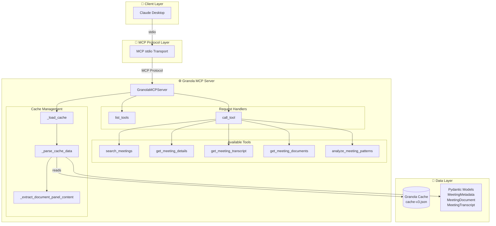
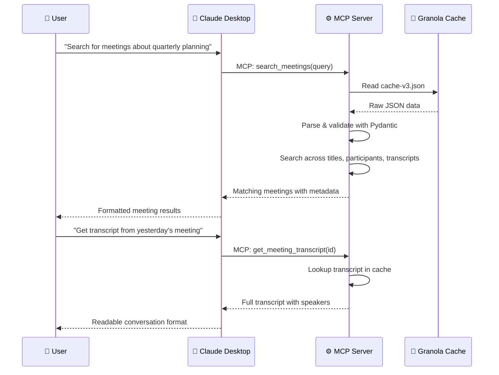

# Granola MCP Server

[](https://www.python.org/downloads/)
[](https://opensource.org/licenses/MIT)
[](https://modelcontextprotocol.io/)

> 🎙️ **AI-Powered Meeting Intelligence for Claude Desktop**

An experimental [Model Context Protocol (MCP)](https://modelcontextprotocol.io/) server that bridges [Granola.ai](https://granola.ai/) meeting intelligence with Claude Desktop. Access your meeting transcripts, notes, and insights directly through natural language conversations.

## ✨ Features

- **🔍 Meeting Search** — Search meetings by title, content, participants, and transcript content
- **📋 Meeting Details** — Get comprehensive meeting metadata with local timezone display
- **📝 Full Transcript Access** — Retrieve complete meeting conversations with speaker identification
- **📄 Rich Document Content** — Access actual meeting notes, summaries, and structured content
- **📊 Pattern Analysis** — Analyze patterns across meetings (participants, frequency, topics)
- **🌍 Timezone Intelligence** — All timestamps automatically display in your local timezone
- **🔒 100% Local Processing** — No external API calls; all data stays on your machine

## 🏗️ Architecture



### Data Flow



## 🛠️ Tech Stack

| Component | Technology |
|-----------|------------|
| **Language** | Python 3.12+ |
| **MCP SDK** | `mcp>=1.0.0` |
| **Data Validation** | Pydantic 2.x |
| **Package Manager** | uv (recommended) or pip |
| **Build System** | Hatchling |
| **Release Automation** | semantic-release (Node.js) |

## 📦 Installation

### Prerequisites

- Python 3.12 or higher
- [uv](https://docs.astral.sh/uv/) package manager (recommended)
- macOS with [Granola.ai](https://granola.ai/) installed
- Claude Desktop application
- Granola cache file at `~/Library/Application Support/Granola/cache-v3.json`

### Quick Setup

1. **Clone the repository:**
   ```bash
   git clone https://github.com/proofgeist/granola-ai-mcp-server.git
   cd granola-ai-mcp-server
   ```

2. **Install dependencies with uv:**
   ```bash
   uv sync
   ```

3. **Test the installation:**
   ```bash
   uv run python test_server.py
   ```

### Alternative: pip installation

```bash
python3 -m venv .venv
source .venv/bin/activate
pip install mcp pydantic
python test_server.py
```

## ⚙️ Configuration

### Claude Desktop Integration

Add the following to your Claude Desktop configuration file:

**macOS:** `~/Library/Application Support/Claude/claude_desktop_config.json`

**Windows:** `%APPDATA%\Claude\claude_desktop_config.json`

**Linux:** `~/.config/Claude/claude_desktop_config.json`

```json
{
  "mcpServers": {
    "granola": {
      "command": "uv",
      "args": ["--directory", "/absolute/path/to/granola-ai-mcp-server", "run", "granola-mcp-server"],
      "env": {}
    }
  }
}
```

> ⚠️ **Important:** Replace `/absolute/path/to/granola-ai-mcp-server` with your actual project path.

### Using pip fallback

If you don't have `uv` installed:

```json
{
  "mcpServers": {
    "granola": {
      "command": "python3",
      "args": ["/absolute/path/to/granola-ai-mcp-server/run_server.py"],
      "env": {
        "PYTHONPATH": "/absolute/path/to/granola-ai-mcp-server/.venv/lib/python3.13/site-packages"
      }
    }
  }
}
```

### Environment Variables

| Variable | Description | Default |
|----------|-------------|---------|
| `GRANOLA_PARSE_PANELS` | Enable parsing of document panels for rich notes | `1` (enabled) |
| `TZ` | Override local timezone detection | Auto-detected |

Set `GRANOLA_PARSE_PANELS=0` to disable document panel parsing if you encounter issues.

## 🚀 Usage

Once configured, restart Claude Desktop and start interacting with your Granola meetings using natural language:

### Search & Discovery

- *"Search for meetings about quarterly planning"*
- *"Show me yesterday's meetings"*
- *"Find meetings with David from this week"*
- *"List all my recent standup meetings"*

### Transcript Access

- *"Get the transcript from yesterday's ProofChat meeting"*
- *"What was discussed in the Float rollback planning meeting?"*
- *"Show me the full conversation from the David Tibbi meeting"*

### Content Analysis

- *"Analyze participant patterns from last month"*
- *"What documents are associated with the product review meeting?"*
- *"Search for mentions of 'schema labeling' in meeting transcripts"*

### Available Tools

| Tool | Description | Parameters |
|------|-------------|------------|
| `search_meetings` | Search meetings by title, content, participants | `query` (string), `limit` (int, optional) |
| `get_meeting_details` | Get detailed information about a meeting | `meeting_id` (string) |
| `get_meeting_transcript` | Get full transcript with speaker identification | `meeting_id` (string) |
| `get_meeting_documents` | Get documents and notes associated with a meeting | `meeting_id` (string) |
| `analyze_meeting_patterns` | Analyze patterns across meetings | `pattern_type` (enum: topics/participants/frequency), `date_range` (optional) |

## 🧪 Development

### Running Tests

```bash
# Run panel parsing test
uv run python test_server.py

# Test with real cache file
uv run python test_real_cache.py
```

### Running the Server Directly

```bash
uv run granola-mcp-server
```

Or using the run script:

```bash
uv run python run_server.py
```

### Project Structure

```
granola-ai-mcp-server/
├── granola_mcp_server/
│   ├── __init__.py          # Package initialization
│   ├── server.py            # Main MCP server implementation (~750 lines)
│   └── models.py            # Pydantic data models
├── .github/
│   └── workflows/
│       └── release.yml      # Semantic release automation
├── tests/
│   ├── test_server.py       # Unit tests with synthetic cache
│   └── test_real_cache.py   # Integration tests with real data
├── pyproject.toml           # Python package configuration
├── package.json             # Node.js deps for semantic-release
├── run_server.py            # Entry point wrapper
├── INSTALL.md               # Detailed installation guide
├── LICENSE                  # MIT License
└── README.md                # This file
```

## 🔒 Security & Privacy

| Feature | Status |
|---------|--------|
| **100% Local Processing** | ✅ All data stays on your machine |
| **No External API Calls** | ✅ No data sent to external services |
| **Granola Permissions Respected** | ✅ Uses existing Granola.ai access controls |
| **Read-Only Access** | ✅ Server only reads from Granola's cache |

## 📊 Performance

- **Fast Loading**: Sub-2 second cache loading for hundreds of meetings
- **Rich Content**: Extracts 25,000+ character transcripts and meeting notes
- **Efficient Search**: Multi-field search across titles, content, participants, and transcripts
- **Memory Optimized**: Lazy loading with intelligent content parsing
- **Production Ready**: Successfully processes real Granola data (11.7MB cache files)
- **Scalable**: Handles large datasets with 500+ transcript segments per meeting

## 🐛 Troubleshooting

### Common Issues

**"Cache file not found"**
```bash
# Ensure Granola.ai is installed and has processed some meetings
ls -la "~/Library/Application Support/Granola/cache-v3.json"
```

**"uv command not found"**
```bash
# Install uv
curl -LsSf https://astral.sh/uv/install.sh | sh
# Or use pip fallback in Claude config
```

**"Permission denied"**
```bash
# Ensure the cache file is readable
chmod 644 "~/Library/Application Support/Granola/cache-v3.json"
```

**Server not appearing in Claude Desktop**
- Verify the absolute path in your Claude config
- Check Claude Desktop logs for MCP server errors
- Restart Claude Desktop after config changes

**Meeting notes appear empty in Claude**
- Granola sometimes stores rich notes inside `documentPanels` rather than `notes_plain`
- This server reads those panels by default; set `GRANOLA_PARSE_PANELS=0` to disable
- Run `python test_real_cache.py` to verify panel-backed notes produce content

## 🤝 Contributing

Contributions are welcome! Please feel free to submit a Pull Request.

1. Fork the repository
2. Create your feature branch (`git checkout -b feature/amazing-feature`)
3. Commit your changes (`git commit -m 'feat: add amazing feature'`)
4. Push to the branch (`git push origin feature/amazing-feature`)
5. Open a Pull Request

Please ensure your code follows the existing style and includes appropriate tests.

## 📄 License

This project is licensed under the MIT License - see the [LICENSE](LICENSE) file for details.

Copyright (c) 2025 [Proof+Geist](https://proofgeist.com/)

## 🙏 Acknowledgments

- [Granola.ai](https://granola.ai/) for the amazing meeting intelligence app
- [Anthropic](https://anthropic.com/) for Claude and the Model Context Protocol
- [Astral](https://astral.sh/) for the uv package manager

---

> ⚠️ **Disclaimer**: This is an experimental project. Granola's cache format may change without notice. Use at your own risk.
